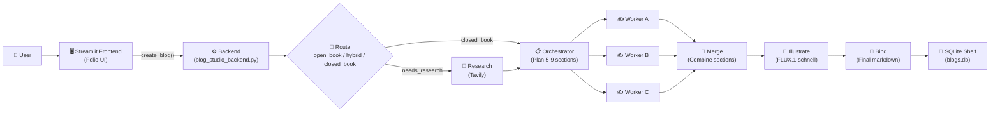

<p align="center">
  
</p>

<p align="center">
  <a href="https://folio-blog-studio.streamlit.app/" target="_blank">
    
  </a>
</p>

<p align="center">
  <a href="#features">Features</a> •
  <a href="#architecture">Architecture</a> •
  <a href="#standalone-pipeline">Standalone Pipeline</a> •
  <a href="#quick-start">Quick Start</a> •
  <a href="#configuration">Configuration</a> •
  <a href="#project-structure">Structure</a>
</p>

<p align="center">
  
  
  
  
  
  
  
  
  
</p>

---

Enter a topic, get a full researched, illustrated blog post. Built on a multi-agent LangGraph pipeline with a Streamlit editorial UI.

## Features

- **Multi-Agent Press Run** — LangGraph StateGraph: Route → Research (Tavily) → Plan → parallel section writers → Merge → Revise → Illustrate (FLUX.1-schnell) → Bind
- **Live Progress** — every pipeline step streams to the UI while it runs
- **Dual-Key Failover** — two Mistral API keys, automatically retried on failure
- **AI Diagrams** — FLUX.1-schnell illustrations generated from captions and inserted under section headings
- **Shelf Library** — every story saved to SQLite with versioning, word count, duration, and markdown export
- **Editorial UI** — light "galley proof" design with a chat-style sidebar; regenerate, edit, and delete with confirmation

## Architecture



| Layer | Technology |
|---|---|
| **Frontend** | Streamlit (custom CSS, editorial design) |
| **Orchestration** | LangGraph StateGraph (6 nodes, fan-out workers) |
| **LLM** | Mistral (dual-key failover via `langchain-mistralai`) |
| **Research** | Tavily Search API (5-10 parallel queries) |
| **Image Generation** | FLUX.1-schnell (Hugging Face Inference API) |
| **Storage** | SQLite (`blogs.db`) + local `images/` |
| **Deployment** | Streamlit Community Cloud |

## Standalone Pipeline

`multi_agent_blog_writer.py` is the **original single-file version** of the pipeline — everything in one 536-line script with no Streamlit UI, no SQLite library, no image generation. It runs the same core flow (Route → Research → Plan → Workers → Merge → Revise → Bind) but outputs markdown directly to stdout.

Use it as a reference for the pipeline logic, or run it standalone:

```bash
python multi_agent_blog_writer.py
```

The full Folio app (`blog_studio_backend.py` + `blog_studio_frontend.py`) is the evolved version with a UI, persistent storage, and diagram generation.

## Quick Start

```bash
git clone https://github.com/kairav7220/folio-blog-studio.git
cd folio-blog-studio
python -m venv .venv
.venv\Scripts\activate        # Windows
pip install -r requirements.txt
```

Copy `.env.example` to `.env` and fill in your keys (see [Configuration](#configuration)):

```env
MISTRAL_API_KEY="..."
MISTRAL_API_KEY_2="..."
TAVILY_API_KEY="..."
HF_API_KEY="..."
```

```bash
streamlit run blog_studio_frontend.py
```

Open `http://localhost:8501` — click **New blog**, enter a topic, and start a press run.

## Configuration

| Variable | Required | Purpose |
|---|---|---|
| `MISTRAL_API_KEY` | Yes | Primary Mistral LLM key |
| `MISTRAL_API_KEY_2` | Optional | Failover Mistral key |
| `TAVILY_API_KEY` | Yes | Tavily web search |
| `HF_API_KEY` | Yes | Hugging Face (FLUX.1-schnell image generation) |

On Streamlit Community Cloud, add these in **Settings > Secrets** (same key names, TOML format). The backend reads from `st.secrets` automatically.

## Project Structure

```
folio-blog-studio/
├── README.md                      # Project documentation
├── blog_studio_backend.py         # Full pipeline + SQLite + progress (self-contained)
├── blog_studio_frontend.py        # Streamlit editorial UI
├── multi_agent_blog_writer.py     # Original standalone pipeline (reference)
├── requirements.txt               # Python dependencies
├── .env.example                   # Required API keys template
├── .streamlit/
│   └── config.toml                # fileWatcherType = "none"
└── .gitignore
```

## License

MIT c [kairav7220](https://github.com/kairav7220)

---

<p align="center">
  Built with <a href="https://streamlit.io">Streamlit</a> •
  <a href="https://langchain-ai.github.io/langgraph">LangGraph</a> •
  <a href="https://www.mistral.ai">Mistral AI</a> •
  <a href="https://tavily.com">Tavily</a> •
  <a href="https://huggingface.co">Hugging Face</a>
</p>
