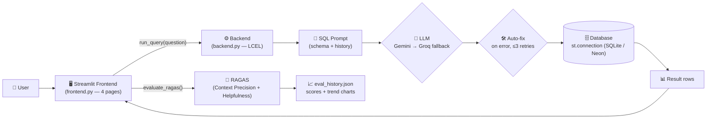

<p align="center">
  
</p>

<p align="center">
  <a href="https://askdb-text-to-sql.streamlit.app/" target="_blank">
    
  </a>
</p>

<p align="center">
  <a href="#features">Features</a> •
  <a href="#architecture">Architecture</a> •
  <a href="#pages">Pages</a> •
  <a href="#standalone-scripts">Standalone Scripts</a> •
  <a href="#quick-start">Quick Start</a> •
  <a href="#evaluation">Evaluation</a> •
  <a href="#project-structure">Structure</a>
</p>

<p align="center">
  
  
  
  
  
  
  
  
</p>

---

Ask a sales question in plain English. AskDB turns it into a SQL query, runs it against the database, and hands back an answer with the rows.

## Features

- **Natural Language → SQL** — ask in plain English, get a streamed SQL query plus the result rows
- **Dual-LLM Failover** — Gemini as primary with an automatic Groq fallback on failure
- **Self-Healing SQL** — failed queries are auto-corrected against the schema (up to 3 retries)
- **Read-Only Guard** — every query is validated to be `SELECT`/`WITH` before it runs
- **RAGAS Evaluation** — one-click benchmark scoring (Context Precision + Helpfulness rubric)
- **Live Schema Viewer** — inspect every table, its columns, and row counts without touching the data
- **CSV → Database** — seed the database from CSVs, import new tables, or rebuild from source
- **Score History** — every benchmark run is saved, charted as trends, and clearable with one click

## Architecture



| Layer | Technology |
|---|---|
| **Frontend** | Streamlit (custom theme, chat + eval dashboard) |
| **Orchestration** | LangChain LCEL (schema → prompt → LLM → parser) |
| **LLM** | Gemini `gemini-flash-lite-latest` primary, Groq `openai/gpt-oss-120b` fallback |
| **Database** | `st.connection('app_db')` — SQLite locally, Neon Postgres on the cloud |
| **Evaluation** | RAGAS (Context Precision, Rubrics-based Helpfulness) |
| **Embeddings** | `sentence-transformers/all-MiniLM-L6-v2` |

## Pages

| Page | What it does |
|---|---|
| **Ask the data** | Chat with the database — question in, SQL + answer + rows out, with a bounded auto-scrolling panel |
| **Schema** | Browse tables, columns, types, keys, and row counts (metadata only, no row data) |
| **Evaluate** | Run a 5-question RAGAS benchmark, view per-question scores, and watch trends over time |
| **Database** | Import a CSV as a new table, rebuild the six seeded tables, or delete only user-added tables |

## Standalone Scripts

`1.py`, `2.py`, and `create_db.py` are the **original single-file versions** of the pipeline — the stepping stones that grew into the full AskDB app. `1.py` runs a minimal Gemini 2.5 Flash LCEL chain against a local SQLite database and prints the generated SQL to stdout. `2.py` extends the same chain to Groq Llama 3.3 70B, runs the five benchmark questions, and scores them with RAGAS (Context Precision + Helpfulness) — the seed of today's **Evaluate** page. `create_db.py` reads the CSVs in `Data_CSV/` and builds the local `text_to_sql.db` SQLite file.

Use them as a reference for the pipeline logic, or run them standalone:

```bash
python 1.py
python 2.py
python create_db.py
```

The full AskDB app (`frontend.py` + `backend.py`) is the evolved version — a Streamlit UI, live schema viewer, streaming chat, self-healing SQL, and the RAGAS evaluation dashboard.

## Quick Start

```bash
git clone https://github.com/kairav7220/AskDB.git
cd AskDB
python -m venv .venv
.venv\Scripts\activate        # Windows
pip install -r requirements.txt
```

Copy `.env.example` to `.env` and fill in your keys (see [Configuration](#configuration)):

```env
GOOGLE_API_KEY="AIza..."
GROQ_API_KEY="gsk_..."
```

```bash
streamlit run frontend.py
```

Open `http://localhost:8501` — ask *"What was the budget of Product 12?"* in the chat and you get the SQL and the result.

## Evaluation

The Evaluate page pushes five fixed questions through the pipeline and scores them with RAGAS — **Context Precision** (retrieval relevance) and a **1–5 Helpfulness rubric**. Each run is appended to `eval_history.json`, so scores can be tracked across runs with trend charts. Use **Clear history** (beside the Score history heading) to wipe all recorded runs.

| Metric | Description |
|---|---|
| Context Precision | How relevant the retrieved schema context was (0–1) |
| Helpfulness | Rubric-scored answer quality (1–5) |

Sample RAGAS results on the five benchmark questions:

| Metric | Score |
|---|---|
| Context Precision | 1.0000 |
| Helpfulness (Rubrics) | 3.80 / 5.00 |

## Project Structure

```
AskDB/
├── README.md                      # Project documentation
├── frontend.py                    # Streamlit app — all four pages + chat
├── backend.py                     # LCEL chains, SQL gen/fix/exec, RAGAS eval
├── vertexai_shim.py               # ragas import shim — do not remove
├── 1.py                           # Minimal Gemini LCEL chain (standalone)
├── 2.py                           # Groq chain + RAGAS evaluation (standalone)
├── requirements.txt               # Python dependencies
├── .env.example                   # Required API keys template
├── .streamlit/
│   ├── config.toml                # Theme (SQLedger light palette)
│   └── secrets.toml               # Local DB URL (gitignored)
├── static/
│   ├── user_avatar.svg            # Chat avatar
│   └── bot_avatar.svg             # Chat avatar
└── Data_CSV/                      # Source CSVs (six seeded tables)
```

## License

MIT © [kairav7220](https://github.com/kairav7220)

---

<p align="center">
  Built with <a href="https://streamlit.io">Streamlit</a> •
  <a href="https://python.langchain.com">LangChain</a> •
  <a href="https://ai.google.dev/gemini-api">Gemini</a> •
  <a href="https://groq.com">Groq</a> •
  <a href="https://neon.tech">Neon</a> •
  <a href="https://docs.ragas.io">RAGAS</a>
</p>
